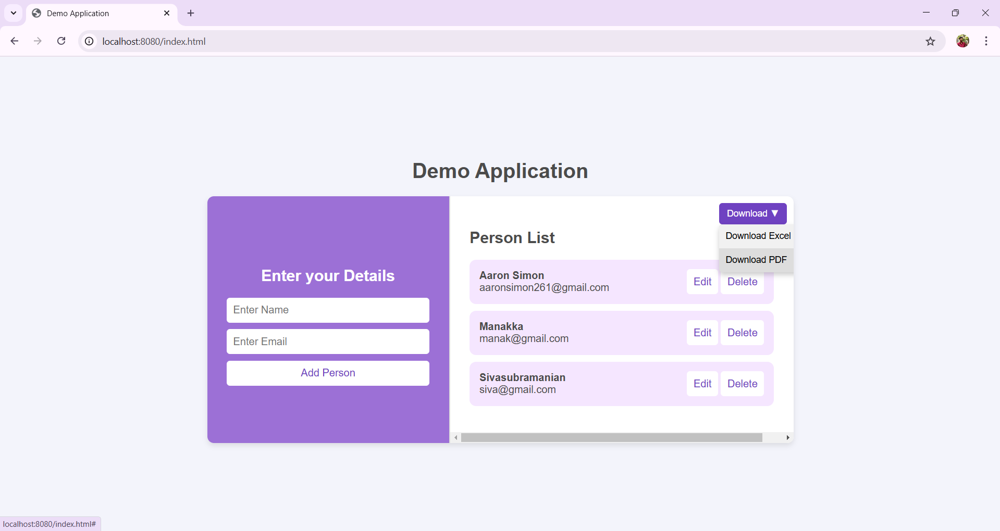

# Spring Boot CRUD Application

## Overview
This is a demo application built using **Spring Boot** and **PostgreSQL** that handles **CRUD (Create, Read, Update, Delete) operations**. It provides a simple form to collect user input and store it in a PostgreSQL database.

Additionally, the application supports exporting stored data as **Excel** and **PDF** files.

## Features
- **User-friendly form** for data entry.
- **CRUD operations** (Create, Read, Update, Delete) with PostgreSQL.
- **Export functionality**:
  - Download database contents as an **Excel file**.
  - Download database contents as a **PDF file**.

## Tech Stack
- **Backend:** Spring Boot (Java)
- **Database:** PostgreSQL
- **File Export:** Apache POI (for Excel), Apache PDFBox (for PDF)

## Installation & Setup
### Prerequisites
- Java 19 or later
- PostgreSQL installed and running
- Maven

### Steps to Run the Application
1. **Clone the repository:**
   ```sh
   git clone <repository-url>
   cd springboot-application
   ```
2. **Configure PostgreSQL:**
   Update the `application.properties` file with your database credentials:
   ```properties
   spring.datasource.url=jdbc:postgresql://localhost:5432/your_database
   spring.datasource.username=your_username
   spring.datasource.password=your_password
   spring.jpa.hibernate.ddl-auto=update
   ```
3. **Build and Run the Application:**
   ```sh
   mvn clean install
   mvn spring-boot:run
   ```
4. **Access the Application:**
   Open your browser and go to:
   ```
   http://localhost:8080/index.html
   ```

## Usage
1. **Fill out the form** with the required details and submit.
2. **View, update, or delete** records from the database.
3. **Download data** as an **Excel** or **PDF** file.

## Screenshots
_Sample image of the application_



## Contributing
Feel free to fork this repository, create a feature branch, and submit a pull request. Contributions are welcome!

## License
This project is licensed under the MIT License.

## Contact
For any issues or suggestions, please reach out via [aaronsimon2612@gmail.com].

